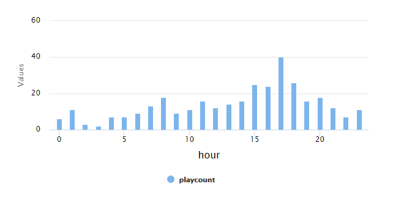
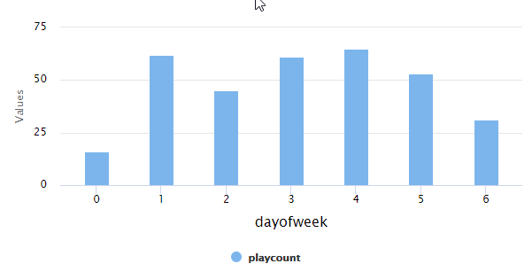
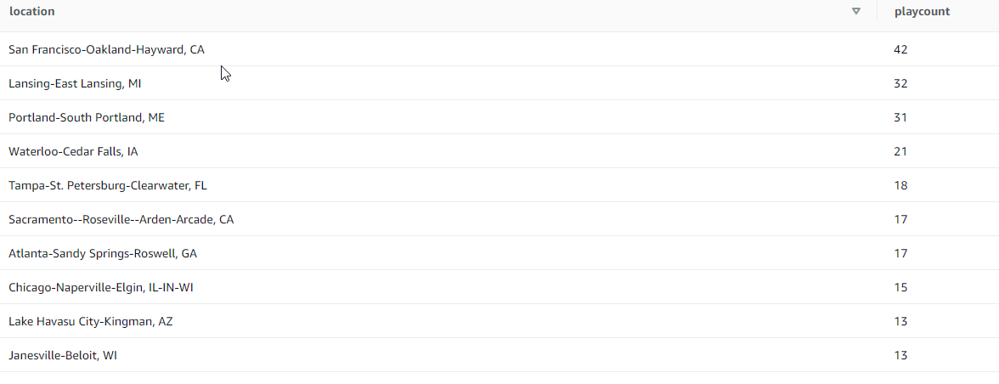

# Project: Data Warehouse

## Scenario

A music streaming startup, Sparkify, has grown their user base and song database and want to move their processes and data onto the cloud. Their data resides in S3, in a directory of JSON logs on user activity on the app, as well as a directory with JSON metadata on the songs in their app.

This project will build an ETL pipeline that extracts their data from S3, stages them in Redshift, and transforms data into a set of dimensional tables for their analytics team to continue finding insights in what songs their users are listening to.

## Project Datasets

This project uses two datasets from AWS S3:

* Song data: s3://udacity-dend/song_data
* Log data: s3://udacity-dend/log_data

### Song Dataset

The first dataset is a subset of real data from the [Million Song Dataset](https://labrosa.ee.columbia.edu/millionsong/). Each file is in JSON format and contains metadata about a song and the artist of that song. The files are partitioned by the first three letters of each song's track ID. For example, here are filepaths to two files in this dataset.

### Log Dataset

he second dataset consists of log files in JSON format generated by this [event simulator](https://github.com/Interana/eventsim) based on the songs in the dataset above. These simulate app activity logs from an imaginary music streaming app based on configuration settings.

The log files in the dataset are partitioned by year and month.

## Project Files

The project template includes the following files:

* create_table.py - creates your fact and dimension tables for the star schema in Redshift.
* etl.py - loads data from S3 into staging tables on Redshift and then process that data into your analytics tables on Redshift.
* sql_queries.py - defines SQL statements which will be imported into the two other files above.
* dwh.cfg - configuration file for ETL process
* create_redshift_cluster.cfg - Configuration for create_redshift_cluster.ipynb notebook
* create_redshift_cluster.ipynb - Notebook that can be used to create a Amazon Redshift Cluster

## Schema

This project will transform the JSON data from AWS S3 into Redshift into staging tables and then load those tables into a star schema with fact and dimension tables.

Staging Tables

* staging.events - Raw data loaded from log dataset
* staging.songs - Raw data loaded from song dataset

### Fact Table

sparkify.songplays - records in event data associated with song plays i.e. records with page NextSong
    songplay_id, start_time, user_id, level, song_id, artist_id, session_id, location, user_agent

### Dimension Tables

sparkify.users - users in the app
    user_id, first_name, last_name, gender, level
sparkify.songs - songs in music database
    song_id, title, artist_id, year, duration
sparkify.artists - artists in music database
    artist_id, name, location, lattitude, longitude
sparkify.time - timestamps of records in songplays broken down into specific units
    start_time, hour, day, week, month, year, weekday

## Example queries

### Play counts by hour of day

```sql
SELECT t.hour as Hour, COUNT(*) as PlayCount
FROM sparkify.songplays sp
JOIN sparkify.time t ON sp.start_time=t.start_time
GROUP BY t.hour
ORDER BY t.hour
```



### Play counts by day of week

```sql
SELECT t.weekday as DayOfWeek, COUNT(*) as PlayCount
FROM sparkify.songplays sp
JOIN sparkify.time t ON sp.start_time=t.start_time
GROUP BY t.weekday
ORDER BY t.weekday
```



### Top 10 User Location Play Counts

```sql
SELECT sp.location, COUNT(*) as PlayCount
FROM sparkify.songplays sp
JOIN sparkify.time t ON sp.start_time=t.start_time
GROUP BY sp.location
ORDER BY PlayCount DESC
LIMIT 10;
```


